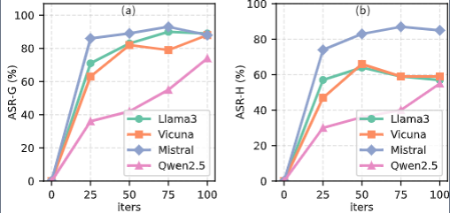

# UNTARGETED JAILBREAK ATTACK


## Abstract

Existing gradient-based jailbreak attacks on Large Language Models (LLMs),such as Greedy Coordinate Gradient (GCG) and COLD-Attack, typically optimizeadversarial sufixes to align the LLM output with a predefined target responseHowever, by restricting the optimization objective as inducing a predefined target.these methods inherently constrain the adversarial search space, which limit theiroverall attack effcacy. Furthermore, existing methods typically require a largenumber of optimization iterations to fulfll the large gap between the fixed targetand the original model response, resulting in low attack effciency.To overcome the limitations of targeted jailbreak attacks, we propose the firstgradient-based untargeted jailbreak attack (UJA), aiming to elicit an unsafe re-sponse without enforcing any predefined patterns. Specifcally, we formulatean untargeted attack objective to maximize the unsafety probability of the LLMresponse, which can be quantified using a judge model. Since the objective isnon-differentiable, we further decompose it into two differentiable sub-objectivesfor optimizing an optimal harmful response and the corresponding adversarialprompt, with a theoretical analysis to validate the decomposition. In contrast totargeted jailbreak attacks, UJA's unrestricted objective significantly expands thesearch space, enabling a more flexible and effcient exploration ofLLM vulnera-bilities. Extensive evaluations demonstrate that UJA can achieve over 80% attacksuccess rates against recent safety-aligned LLMs with only 100 optimization itera-tions, outperforming the state-of-the-art gradient-based attacks such as I-GCG andCOLD-Attack by over 20%.


## Quick Start

### Preparation

Befor we start, we need to download the target LLMs you want to jailbreak and the dataset you want to use. We list the six target LLMs and two benchmark datasets used in our paper below:

**Target LLMs** </br>
1. Llama-3-8B-Instruct
2. Llama-3.1-8B-Instruct
3. Qwen-2.5-7B-Instruct
4. Qwen-3-8B-Instruct
5. Vicuna-7B-v1.5
6. Mistral-7B-Instruct-v0.3

Below is the links you can download these LLMs:

---------------
| Model Name               | Link                                                       |
|--------------------------|------------------------------------------------------------|
| Llama-3-8B-Instruct      | https://huggingface.co/meta-llama/Meta-Llama-3-8B-Instruct |
| Llama-3.1-8B-Instruct    | https://huggingface.co/meta-llama/Llama-3.1-8B-Instruct    |
| Qwen2.5-7B-Instruc       | https://huggingface.co/Qwen/Qwen2.5-7B-Instruct            |
| Qwen3-8B-Instruct        | https://huggingface.co/Qwen/Qwen3-8B                       |
| Vicuna-7B-v1.5           | https://huggingface.co/lmsys/vicuna-7b-v1.5                |
| Mistral-7B-Instruct-v0.3 | https://huggingface.co/mistralai/Mistral-7B-Instruct-v0.3  |


**Benchmark Datasets** </br>
1. AdvBench
2. HarmBench 
3. StrongReject

| Dataset      | Link                                                         |
|-----------   |--------------------------------------------------------------|
| AdvBench     | https://github.com/llm-attacks/llm-attacks                   |
| HarmBench    | https://huggingface.co/datasets/JailbreakBench/JBB-Behaviors |


After downloading three benchmark datasets, you need to put them into ``./data`` folder (if not exist, create a folder with the same name).


Additionally, in order to evaluate the harmfulness of generated responses, we employ two evaluators in our paper to score each response: </br>
1. GPTFuzzer (ASR-G)
2. HarmBench-Llama-2-13b-cls (ASR-H)

| Model Name             | Link                                                       |
|------------------------|------------------------------------------------------------|
| GPTFuzzer              | https://huggingface.co/hubert233/GPTFuzz                   |
| Llama-Guard-3-8B       | https://huggingface.co/cais/HarmBench-Llama-2-13b-cls      |


### Code
**1) Download this GitHub**
```
git clone https://github.com/hxz-sec/Untargeted-Jailbreak-Attack
```

**2) Setup Environment**

We recommend conda for setting up a reproducible experiment environment.
We include `environment.yaml` for creating a working environment:

```bash
conda env create -f environment.yaml -n ca2
```

Then use requirements.txt or manually install pip in the project:
```
pip install -r requirements.txt
```

**3) Run Command for Untargeted-Jailbreak-Attack**

Run the main code :
```bash
conda activate ca2
```
```
python scripts/main_split_gptfuzz.py
```
Evaluate:
```
python evaluate/evaluate.py 
```

Drawing:
```
python plot/asr_comparison_methods.py 
python plot/attack_asr_comparison.py 
python plot/response_diversity.py
```


## Experiments

### Result
Here we demonstrate the effectiveness of UJA compared to the baseline. The detailed results are shown in the following table：

| Dataset   | Model    | GCG-G | GCG-H | COLD-G | COLD-H | DRL-G | DRL-H | PAP-G | PAP-H | AdvPrefix-G | AdvPrefix-H | I-GCG-G | I-GCG-H | llm-adaptive-G | llm-adaptive-H | Ours-G | Ours-H |
|-----------|----------|-------|-------|--------|--------|-------|-------|-------|-------|-------------|-------------|---------|---------|----------------|----------------|--------|--------|
| AdvBench  | Llama-3  | 50    | 40    | 52     | 44     | 30    | 28    | 21    | 62    | 40          | 15          | 23      | 11      | 51             | 0             |**89**  | **67** |
|           | Llama-3.1| 51    | 42    | 57     | 47     | 25    | 45    | 31    | 77    | 42          | 22          | 23      | 13      | 60             | 1             |**86**  | **80** |
|           | Qwen-2.5 | 31    | 37    | 28     | 35     | 36    | 64    | 41    | 82    | 28          | 36          | 8       | 10      | 29             | 32            |**74**  | **55** |
|           | Qwen-3   | 30    | 15    | 54     | 27     | 24    | 42    | 14    | 74    | 29          | 12          | 12      | 2       | 62             | 6             |**59**  | **33** |
|           | Vicuna   | 28    | 21    | 52     | 40     | 29    | 27    | 2     | 3     | 41          | 17          | 25      | 5       | 41             | 1             |**88**  | **59** |
|           | Mistral  | 70    | 81    | 72     | 73     | 34    | 94    | 38    | 84    | 66          | 65          | 38      | 38      | 44             | 46            |**88**  | **85** |
| **Avg.**  | AdvBench | 43.3  | 39.3  | 52.5   | 44.3   | 29.7  | 50.0  | 24.5  | 63.7  | 41.0        | 27.8        | 21.5    | 13.2    | 47.8           | 14.3             |**80.7**|**63.2**|
| HarmBench | Llama-3  | 22    | 40    | 38     | 41     | 33    | 44    | 16    | 64    | 43          | 20          | 13      | 4       | 37             | 7             |**65**  | **73** |
|           | Llama-3.1| 31    | 50    | 43     | 44     | 35    | 37    | 19    | 71    | 44          | 24          | 16      | 9       | 35             | 3             |**47**  | **62** |
|           | Qwen-2.5 | 24    | 53    | 32     | 51     | 41    | 78    | 33    | 84    | 29          | 36          | 17      | 19      | 16             | 31            | **64** | **66** |
|           | Qwen-3   | 18    | 19    | 36     | 24     | 22    | 39    | 10    | 76    | 25          | 6           | 8       | 5       | 41             | 2             |**56**  | **29** |
|           | Vicuna   | 22    | 12    | 39     | 27     | 30    | 55    | 1     | 3     | 36          | 16          | 17      | 6       | 23             | 2             |**66**  | **64** |
|           | Mistral  | 37    | 67    | 38     | 75     | 34    | 84    | 31    | 77    | 60          | 59          | 30      | 41      | 33             | 56            |**67**  | **81** |
| **Avg.**  | HarmBench| 25.7  | 40.2  | 37.7   | 43.7   | 32.5  | 56.2  | 18.3  | 62.5  | 39.5        | 26.8        | 16.8    | 14.0    | 30.8           | 16.8             |**60.8**|**62.5**|


t-SNE visualization of response embeddings generated by six jailbreak methods on the AdvBench dataset


Convergence of cumulative ASR of UJA on four LLMs from the AdvBench dataset: (a) ASR-G and (b) ASR-H



baseline attack methods failed to bypass Llama-3’s security protections, ultimately causing the model to refuse to answer. However, within just 100 optimization iterations, UJA successfully generated a jailbreak prompt, prompting Llama-3 to provide detailed steps regarding insider trading. This answer was judged "unsafe" by both ASR-G and ASR-H.


Traditional jailbreaking methods typically restrict jailbreaking targets to predefined, fixed responses, such as "Of course, this is..." This limits the adversarial search space and reduces attack efficiency. In contrast, UJA employs an untargeted attack strategy that doesn’t follow any predefined pattern, aiming to maximize the "unsafe" score of the response.

