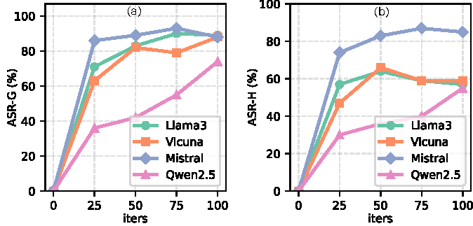

# UNTARGETED JAILBREAK ATTACK


## Abstract

Existing gradient-based jailbreak attacks on Large Language Models (LLMs),such as Greedy Coordinate Gradient (GCG) and COLD-Attack, typically optimizeadversarial sufixes to align the LLM output with a predefined target responseHowever, by restricting the optimization objective as inducing a predefined target.these methods inherently constrain the adversarial search space, which limit theiroverall attack effcacy. Furthermore, existing methods typically require a largenumber of optimization iterations to fulfll the large gap between the fixed targetand the original model response, resulting in low attack effciency.To overcome the limitations of targeted jailbreak attacks, we propose the firstgradient-based untargeted jailbreak attack (UJA), aiming to elicit an unsafe re-sponse without enforcing any predefined patterns. Specifcally, we formulatean untargeted attack objective to maximize the unsafety probability of the LLMresponse, which can be quantified using a judge model. Since the objective isnon-differentiable, we further decompose it into two differentiable sub-objectivesfor optimizing an optimal harmful response and the corresponding adversarialprompt, with a theoretical analysis to validate the decomposition. In contrast totargeted jailbreak attacks, UJA's unrestricted objective significantly expands thesearch space, enabling a more flexible and effcient exploration ofLLM vulnera-bilities. Extensive evaluations demonstrate that UJA can achieve over 80% attacksuccess rates against recent safety-aligned LLMs with only 100 optimization itera-tions, outperforming the state-of-the-art gradient-based attacks such as I-GCG andCOLD-Attack by over 20%.

**Figure 1.** Jailbreak example.  


**Figure 2.** Workflow of UJA framework.  


## Quick Start

### Preparation

Befor we start, we need to download the target LLMs you want to jailbreak and the dataset you want to use. We list the six target LLMs and two benchmark datasets used in our paper below:

**Target LLMs** </br>
1. Llama-3-8B-Instruct
2. Qwen-3-8B
3. Mistral-7B-Instruct-v0.3
4. Vicuna-7B-v1.5
5. Gemma-2-9b-it


Below is the links you can download these LLMs:

---------------
| Model Name               | Link                                                       |
| ------------------------ | ---------------------------------------------------------- |
| Llama-3-8B-Instruct      | https://huggingface.co/meta-llama/Meta-Llama-3-8B-Instruct |
| Qwen3-8B                 | https://huggingface.co/Qwen/Qwen3-8B                       |
| Mistral-7B-Instruct-v0.3 | https://huggingface.co/mistralai/Mistral-7B-Instruct-v0.3  |
| Vicuna-7B-v1.5           | https://huggingface.co/lmsys/vicuna-7b-v1.5                |
| Gemma-2-9b-it            | https://huggingface.co/google/gemma-2-9b-it                |


**Benchmark Datasets** </br>
1. AdvBench
2. HarmBench 

| Dataset   | Link                                                         |
| --------- | ------------------------------------------------------------ |
| AdvBench  | https://github.com/llm-attacks/llm-attacks                   |
| HarmBench | https://huggingface.co/datasets/JailbreakBench/JBB-Behaviors |


After downloading three benchmark datasets, you need to put them into ``./data`` folder (if not exist, create a folder with the same name).


Additionally, in order to evaluate the harmfulness of generated responses, we employ two evaluators in our paper to score each response: </br>
1. GPTFuzzer (ASR-G)
2. HarmBench-Llama-2-13b-cls (ASR-H)

| Model Name                | Link                                                  |
| ------------------------- | ----------------------------------------------------- |
| GPTFuzzer                 | https://huggingface.co/hubert233/GPTFuzz              |
| HarmBench-Llama-2-13b-cls | https://huggingface.co/cais/HarmBench-Llama-2-13b-cls |


### Code
**1) Download this GitHub**
```
git clone https://github.com/hxz-sec/Untargeted-Jailbreak-Attack
```

**2) Setup Environment**

We recommend conda for setting up a reproducible experiment environment.
We include `environment.yaml` for creating a working environment:

```bash
conda env create -f environment.yaml -n ca2
```

Then use requirements.txt or manually install pip in the project:
```
pip install -r requirements.txt
```

**3) Run Command for Untargeted-Jailbreak-Attack**

Run the main code :
```bash
conda activate ca2
```
```
python scripts/main.py
```
Evaluate:
```
python evaluate/evaluate.py 
```


## Experiments

### Result
Here we demonstrate the effectiveness of UJA compared to the baseline. The detailed results are shown in the following table：


Table: Comparison of ASRs achieved by UJA and baseline methods across two datasets on five white-box LLMs. **The ASRs are measured after performing *only 100 iterations* for each prompt.**


## AdvBench

| Method      | Metric |    Llama |     Qwen |  Mistral |   Vicuna |    Gemma |
| ----------- | ------ | -------: | -------: | -------: | -------: | -------: |
| GCG         | ASR-G  |     51.0 |     34.0 |     21.0 |     28.0 |     17.0 |
|             | ASR-H  |     41.0 |     18.0 |      8.0 |     21.0 |     18.0 |
| COLD        | ASR-G  |     52.0 |     54.0 |     72.0 |     52.0 |     10.0 |
|             | ASR-H  |     44.0 |     27.0 |     73.0 |     40.0 |     10.0 |
| AdvPrefix   | ASR-G  |     40.0 |     28.0 |     31.0 |     41.0 |      8.0 |
|             | ASR-H  |     17.0 |     17.0 |     13.0 |     17.0 |     11.0 |
| AdvPrompter | ASR-G  |     50.0 |     40.0 |     86.0 |     57.0 |     62.0 |
|             | ASR-H  |     58.0 |     41.0 |     93.0 |     50.0 |     55.0 |
| DRL         | ASR-G  |     30.0 |     24.0 |     20.0 |     29.0 |     32.0 |
|             | ASR-H  |     28.0 |     42.0 |     50.0 |     27.0 |     63.0 |
| ECLIPSE     | ASR-G  |     63.0 |     67.0 |     68.0 |     71.0 |     66.0 |
|             | ASR-H  |     53.0 |     48.0 |     56.0 |     58.0 |     47.0 |
| PAIR        | ASR-G  |     59.0 |     55.0 |     57.0 |     65.0 |     62.0 |
|             | ASR-H  |     66.0 |     57.0 |     54.0 |     50.0 |     52.0 |
| UJA (Ours)  | ASR-G  | **85.0** | **67.0** | **88.0** | **91.0** | **57.0** |
|             | ASR-H  | **86.0** | **65.0** | **89.0** | **92.0** | **60.0** |


## HarmBench

| Method      | Metric |    Llama |     Qwen |  Mistral |   Vicuna |    Gemma |
| ----------- | ------ | -------: | -------: | -------: | -------: | -------: |
| GCG         | ASR-G  |     22.0 |     18.0 |     39.0 |     22.0 |      9.0 |
|             | ASR-H  |     40.0 |     19.0 |     63.0 |     12.0 |      9.0 |
| COLD        | ASR-G  |     38.0 |     36.0 |     40.0 |     39.0 |     22.0 |
|             | ASR-H  |     41.0 |     24.0 |     69.0 |     27.0 |     26.0 |
| AdvPrefix   | ASR-G  |     43.0 |     25.0 |     60.0 |     36.0 |     12.0 |
|             | ASR-H  |     20.0 |      6.0 |     59.0 |     16.0 |     11.0 |
| AdvPrompter | ASR-G  |     37.0 |     28.0 |     43.0 |     33.0 |     28.0 |
|             | ASR-H  |     69.0 |     46.0 |     61.0 |     55.0 |     46.0 |
| DRL         | ASR-G  |     33.0 |     22.0 |     22.0 |     30.0 |     35.0 |
|             | ASR-H  |     44.0 |     39.0 |     32.0 |     55.0 |     35.0 |
| ECLIPSE     | ASR-G  |     36.0 |     37.0 |     42.0 |     39.0 |     38.0 |
|             | ASR-H  |     45.0 |     45.0 |     31.0 |     44.0 |     34.0 |
| PAIR        | ASR-G  |     38.0 |     37.0 |     41.0 |     44.0 |     42.0 |
|             | ASR-H  |     75.0 |     47.0 |     51.0 |     42.0 |     45.0 |
| UJA (Ours)  | ASR-G  | **61.0** | **64.0** | **60.0** | **69.0** | **41.0** |
|             | ASR-H  | **72.0** | **63.0** | **57.0** | **89.0** | **40.0** |


**Figure 3.** t-SNE visualization of response embeddings generated by four jailbreak methods on the AdvBench dataset.  


**Figure 4.** Convergence of cumulative ASR of UJA on five white-box LLMs from the AdvBench dataset: (a) ASR-G and (b) ASR-H.  


**Figure 5.** Example of a UJA Optimized Jailbreak Prompt across Multiple LLMs on AdvBench.


**Figure 6.** Example of a UJA-Optimized Jailbreak Prompt Compared with Baselines on Llama-3 across AdvBench.  


**Figure 7.**  Example of a UJA Optimized Jailbreak Response Compared with Baselines on Qwen-3 across AdvBench.


## Lisence
This project is licensed under the MIT License.